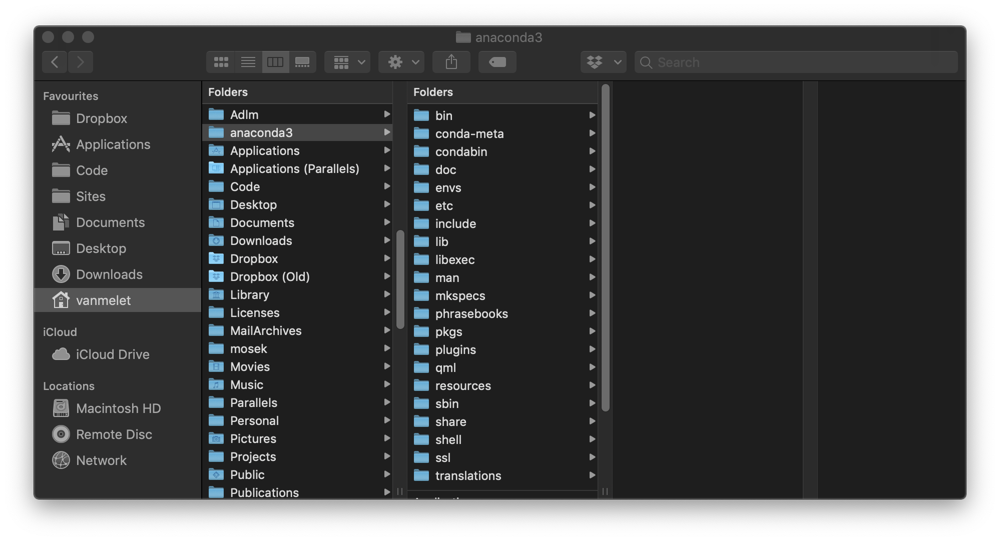
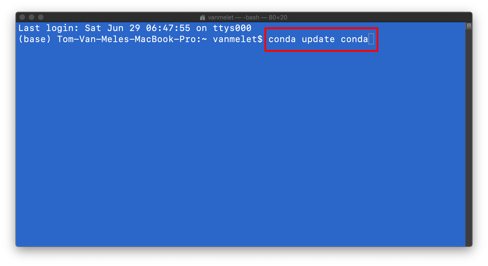
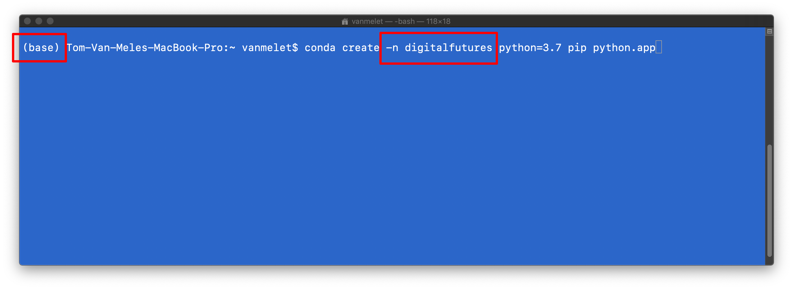
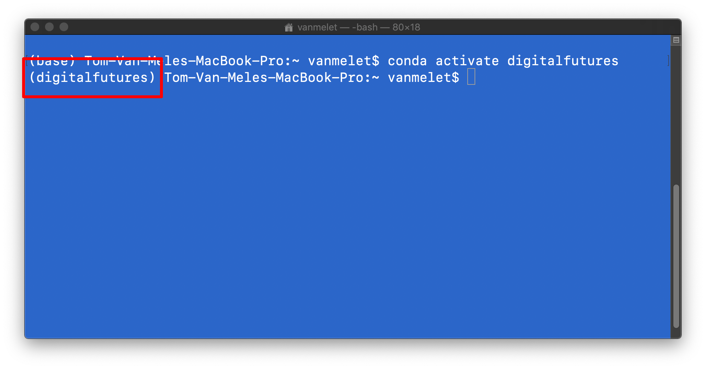
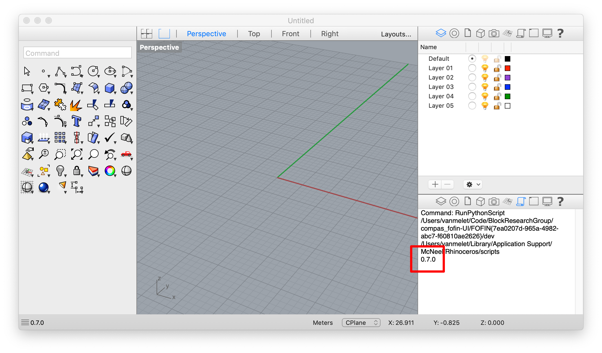

# Getting started on Mac

## Requirements

* [Anaconda 3](https://repo.anaconda.com/archive/Anaconda3-2019.03-MacOSX-x86_64.pkg)
* [Rhino](https://www.rhino3d.com/download)
* [Visual Studio Code](https://code.visualstudio.com/)
* [Git](https://git-scm.com/downloads) (or XCode command line tools)

**Make sure to install Anaconda on your home drive, which should be the recommended location.**



## Preparation

Download the workshop files from the GitHub repo at https://www.github.com/BlockResearchGroup/WS_digitalfutures. Unzip the archive to a location on your computer that is easily accessible. For example, in a folder on your home drive.


> Note that the archive will be named `WS_digitalfutures-master.zip` and will contain a folder `WS_digitalfutures-master`. When you unzip it, make sure that the contents of the folder are not in `WS_digitalfutures-master\WS_digitalfutures-master`. Finally, remove `-master` from the unzipped folder name. 

## Installation

The various steps of the installation procedure will be executed using the Terminal app. To open the app, hit `COMMAND+SPACE` and type "Terminal".

**1. Update conda**

Update `conda`, the package and environment manager of Anaconda.

```bash
conda update conda
```



**2. Register conda-forge**

COMPAS is available through the `conda-forge` channel. Add the channel to your conda configuration.

```bash
conda config --add channels conda-forge
```

**3. Create a virtual environment**

Create a virtual environment for this workshop named "digitalfutures" running on Python 3.7 (`python=3.7`) and install `pip` and the Python framework build (`python.app`).

```bash
conda create -n digitalfutures python=3.6 pip python.app
```



**4. Activate the environment**

Activate the "digitalfutures" environment such that all following commands are executed within the context of this environment.

```bash
conda activate digitalfutures
```

> When the "digitalfutures" environment is active, the name "digitalfutures" will appear in parentheses in front of the prompt.



**5. Install COMPAS**

Install the core Python packages of the COMPAS framework in the active environment.

```bash
conda install COMPAS=0.7.1
```

**6. Install compas_fofin**

Install `compas_fofin`, a COMPAS package for designing cable-net structures.

```bash
pip install git+https://www.github.com/BlockResearchGroup/compas_fofin.git#egg=compas_fofin
```

**7. Download compas_fofin-UI**

Download the Rhino UI for `compas_fofin` from the GitHub repo: https://www.github.com/BlockResearchGroup/compas_fofin-UI. Unzip the archive at an easily accessible location on your computer. For example, in the folder containing the workshop files.

## Verify Installation

To verify the installation, start an interactive Python interpreter.
Type `python` in the Terminal. Make sure the "digitalfutures" environment is active!

```bash
python
```

Import `compas` and print the version number.

```python
>>> import compas
>>> compas.__version__
'0.7.1'
```

Import `compas_fofin` and print the version number.

```python
>>> import compas_fofin
>>> compas_fofin.__version__
'0.1.0'
```

## Rhino Configuration

**1. Install COMPAS packages**

With the "digitalfutures" environment active, install `compas`, `compas_rhino`, and `compas_fofin` for Rhino.

```bash
python -m compas_rhino.install -p compas compas_rhino compas_fofin
```

The packages will become available the next time you start Rhino.

**2. Install compas_fofin-UI**

Navigate to the location where you downloaded and unzipped the `compas_fofin-UI` repo. To install the UI, type

```bash
python -m compas_rhino.install_plugin FOFIN{7ea0207d-965a-4982-abc7-f60810ae2626}
```

The UI will be available next time you start Rhino.

**Once packages are installed in Rhino, it no longer matters which environment is active. It is also not necessary to have the Terminal running. Rhino will use the installed packages from the environment that was active when you installed them.**

## Verify Rhino Configuration

Open Rhino and type the command `RunPythonScript`.
Open and run the file `verify_rhino.py` which is in the workshop folder. The version of `compas` should be printed in the Command History window.


