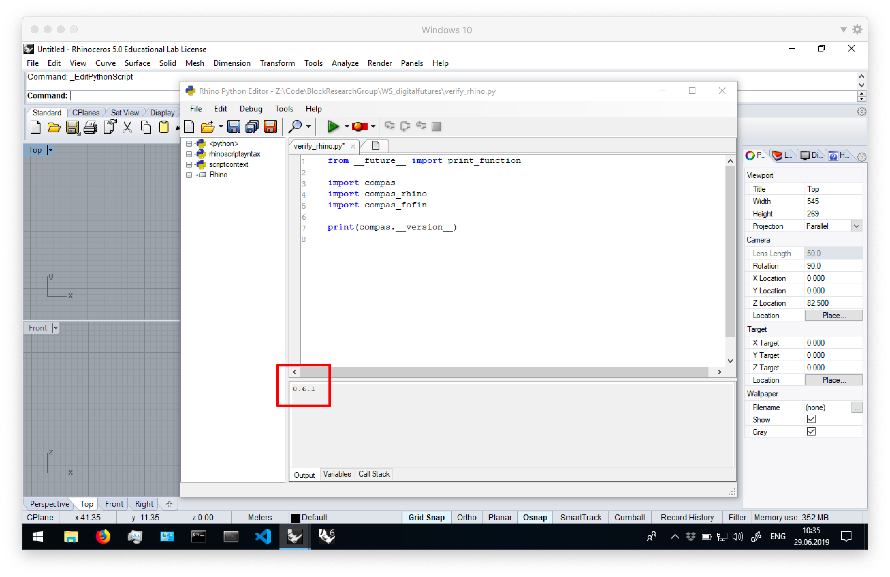

# Getting started on Windows

## Requirements

* [Anaconda 3](https://repo.anaconda.com/archive/Anaconda3-2019.03-MacOSX-x86_64.pkg)
* [Rhino](https://www.rhino3d.com/download)
* [Visual Studio Code](https://code.visualstudio.com/)
* [Git](https://git-scm.com/downloads)

**Make sure to install Anaconda on your home drive, which should be the recommended location.**

Your home drive will be in a location similar to

```
C:\Users\user
```

or 

```
C:\Users\<username>
```

with `<username>` your username.

## Preparation

Download the workshop files from the GitHub repo at https://www.github.com/BlockResearchGroup/WS_digitalfutures. Unzip the archive at a location on your computer that is easily accessible. The recommended location is in a folder on your home drive.


> Note that the archive will be named `WS_digitalfutures-master.zip` and will contain a folder `WS_digitalfutures-master`. When you unzip it, don't include `WS_digitalfutures-master` in the destination path. Otherwise the contents of the folder will be in `WS_digitalfutures-master\WS_digitalfutures-master`. Finally, remove `-master` from the unzipped folder name. 

## Installation

Please use the *Anaconda Prompt* (and **NOT** the Windows Command Prompt) to execute the various steps of the installation procedure. To open the Anaconda Prompt, just strat typing "Anaconda" with the Windows Start Menu open and it will appear in the results list.


**1. Update conda**

Update `conda`, the package and environment manager of Anaconda.

```bash
conda update conda
```


**2. Register conda-forge**

COMPAS is available through the `conda-forge` channel. Add the channel to your configuration.

```bash
conda config --add channels conda-forge
```

**3. Create a virtual environment**

Create a virtual environment for this workshop named "digitalfutures" running on Python 3.7 (`python=3.7`), and install `pip`.

```bash
conda create -n digitalfutures python=3.6 pip
```


**4. Activate the environment**

Activate the "digitalfutures" environment such that all following commands are executed within the context of this environment.

```bash
conda activate digitalfutures
```

> When the "digitalfutures" environment is active, the name "digitalfutures" will appear in parentheses in front of the prompt.


**5. Install COMPAS**

Install the core Python packages of the COMPAS framework in the active environment.

```bash
conda install COMPAS=0.7.1
```

**6. Install compas_fofin**

Install `compas_fofin`, a Python package for designing cable-net structures.

```bash
pip install git+https://www.github.com/BlockResearchGroup/compas_fofin.git#egg=compas_fofin
```

**7. Download compas_fofin-UI**

Download the Rhino UI for `compas_fofin` from the GitHub repo: https://www.github.com/BlockResearchGroup/compas_fofin-UI. For example, to the same location as the workshop files.

## Verify Installation

To verify the installation, start an interactive Python interpreter.
Type `python` in the Anaconda Prompt. Make sure the "digitalfutures" environment is active!

```bash
python
```

Import `compas` and print the version number.

```python
>>> import compas
>>> compas.__version__
'0.7.1'
```

Import `compas_fofin` and print the version number.

```python
>>> import compas_fofin
>>> compas_fofin.__version__
'0.1.0'
```

## Rhino Configuration

**1. Install COMPAS packages**

With the "digitalfutures" environment active, install `compas`, `compas_rhino`, and `compas_fofin` for Rhino.

```bash
python -m compas_rhino.install -p compas compas_rhino compas_fofin
```

The default Rhino version is `6.0`. If you wish to install COMPAS packages for Rhino 5, just add a version flag.

```bash
python -m compas_rhino.install -v 5.0 -p compas compas_rhino compas_fofin
```

The packages will become available the next time you start Rhino.

**2. Install compas_fofin-UI**

Navigate to the location where you downloaded and unzipped the `compas_fofin-UI` repo.

```bash
python -m compas_rhino.install_plugin FOFIN{7ea0207d-965a-4982-abc7-f60810ae2626}
```

The default Rhino version is `6.0`. If you wish to install COMPAS plugins for Rhino 5, just add a version flag.

```bash
python -m compas_rhino.install_plugin -v 5.0 FOFIN{7ea0207d-965a-4982-abc7-f60810ae2626}
```

**Once packages are installed in Rhino, it no longer matters which environment is active. It is also not necessary to have the Anaconda Prompt running. Rhino will use the installed packages from the environment that was active when you installed them.**

## Verify Rhino Configuration

Open Rhino and type the command `EditPythonScript`.
Open and run the file `verify_rhino.py` which is in the workshop folder. The version of `compas` should be printed in the Output window.

Alternatively, you can paste the following code in an empty script.

```python
from __future__ import print_function

import compas
import compas_rhino
import compas_fofin

print(compas.__version__)
```


